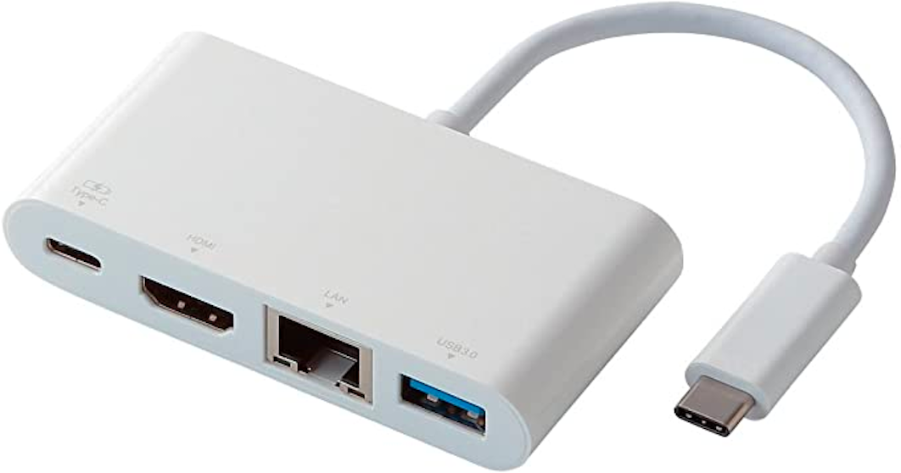
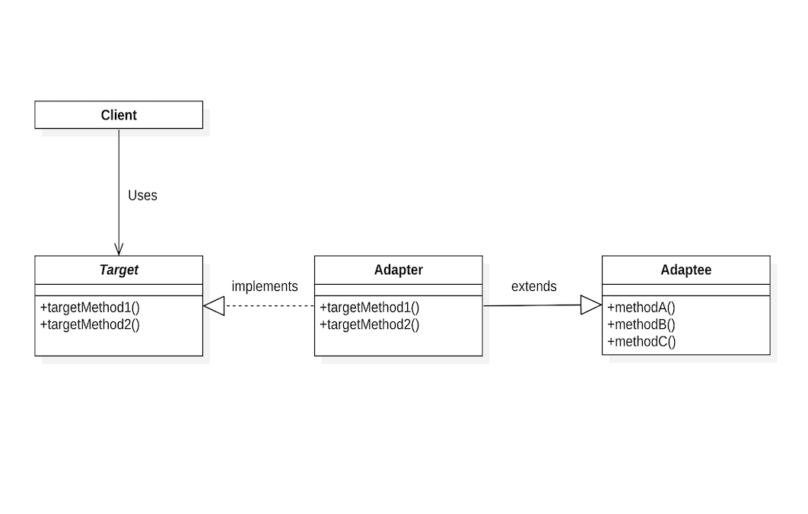
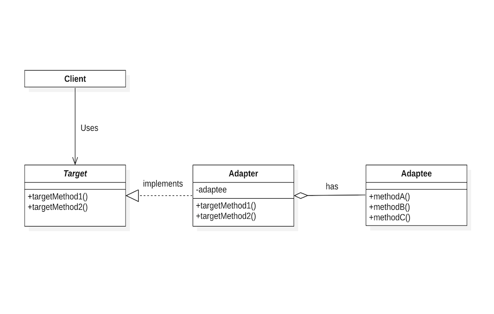
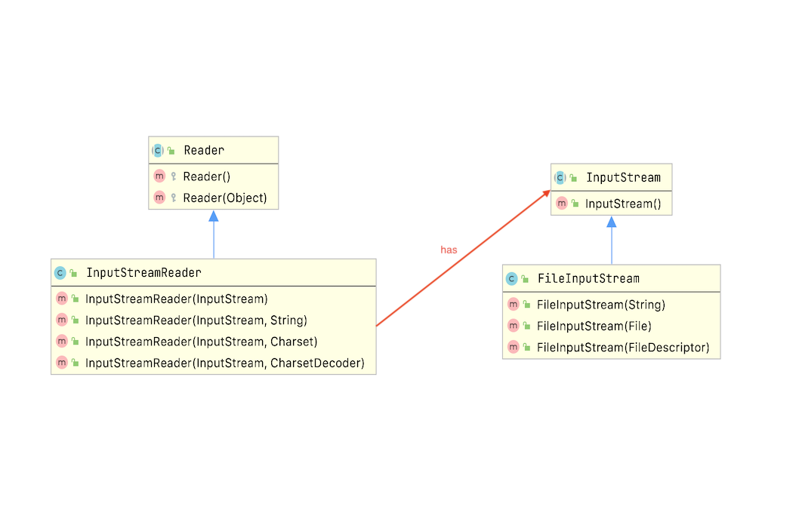

# Adapter - 适配器
> *将一个类的接口转换成客户希望的另一个接口。Adapter模式使得原本由于接口不兼容而不能一起工作的那些类可以一起工作。*

## 动机
目前做开发时所使用的PC是MacBook Pro，接口类型为4个雷霆3（USB-C）端口，虽然能够理解苹果想要推进使用雷霆3接口的用意，但在雷霆3接口还没有普及的今天使用起来着实有些不便。我所需要的接口类型为雷霆3接口，而你能够为我提供的接口类型为USB3.0, LAN, HDMI······ 这时就需要使用适配器来将你所能够为我提供的接口转换为我所希望的接口。在程序开发中也是一样，我们通常使用适配器模式**将一个类的接口转换成客户希望的另一个接口**。

（下图是我目前所使用的适配器）


**一个应用可能会有一些类具有不同的接口并且这些接口互不兼容**。设想我们现在使用JAVA语言想要操作properties文件中的配置信息，我们设计了如下接口：

```java
public interface FileIO {

    void readFromFile(String filename) throws IOException;

    void writeToFile(String filename) throws IOException;

    void setValue(String key, String value);

    String getValue(String key);

}
```

想要从零去实现它未免有些复杂，这时我们想到JAVA的标准工具包里已经为我们提供了`Properties`类用来操作文字列的键值对，它的接口信息如下：

```java
public class Properties extends Hashtable<Object,Object> {
    
    public synchronized void load(InputStream inStream) throws IOException {
        // ・・・
    }

    public void store(OutputStream out, String comments) throws IOException {
        // ・・・
    }

    public synchronized Object setProperty(String key, String value) {
        // ・・・
    }

    public String getProperty(String key) {
        // ・・・
    }
    
}
```

这不正是我们所需要的吗，并且它已经经过了大量测试来验证了它的正确性，但和我们所期望的还是稍微有些不同，如何让它们协同工作呢，显然我们并不能够去修改`Properties`类的源代码。然而即使我们可以去修改也是没有任何意义的，因为不应该仅仅为了实现一个应用，工具箱就不得不采用一些与特定领域相关的接口。

我们可以去定义一个`FileProperties`类由它来完成`FileIO`接口与`Properties`接口之间的适配，有两种方法可以做到这一点：
1. 继承`Properties`类并实现`FileIO`接口。（适配器模式**类**版本）
2. 将一个`Properties`实例作为`FileProperties`的组成部分。（适配器模式**对象**版本）

这里的`FileProperties`所充当的就是适配器的角色。

具体实现如下：
1. 适配器模式类版本。
```java
public class FileProperties extends Properties implements FileIO {

    @Override
    public void readFromFile(String filename) throws IOException {
        load(new FileInputStream(filename));
    }

    @Override
    public void writeToFile(String filename) throws IOException {
        store(new FileOutputStream(filename),
                String.format("written by %s", this.getClass().getSimpleName()));
    }

    @Override
    public void setValue(String key, String value) {
        setProperty(key, value);
    }

    @Override
    public String getValue(String key) {
        return getProperty(key);
    }

}
```

2. 适配器模式对象版本。

```java
public class FileProperties implements FileIO {

    private Properties properties = new Properties();

    @Override
    public void readFromFile(String filename) throws IOException {
        properties.load(new FileInputStream(filename));
    }

    @Override
    public void writeToFile(String filename) throws IOException {
        properties.store(new FileOutputStream(filename),
                String.format("written by %s", this.getClass().getSimpleName()));
    }

    @Override
    public void setValue(String key, String value) {
        properties.setProperty(key, value);
    }

    @Override
    public String getValue(String key) {
        return properties.getProperty(key);
    }

}
```

## 结构
1. 类适配器使用`extends`与`implements`对一个接口与另一个接口进行匹配。


2. 对象适配器依赖于对象组合对一个接口与另一个接口进行匹配。


* Client
  - 与符合Target接口的对象协同。
* Target
  - 定义Client使用的与特定领域相关的接口。
* Adaptee
  - 定义一个已经存在的接口，这个接口需要适配。
* Adapter
  - 对Adaptee的接口与Target接口进行适配。

## 适用性
* 你想使用一个已经存在的类，而它的接口不符合你的需求。
* 你想创建一个可以复用的类，该类可以与其他不相关的类或不可预见的类（即那些接口可能不一定兼容的类）协同工作。
* （仅适用于对象适配器）你想使用一些已经存在的子类，但是不可能对每一个都进行子类化以匹配它们的接口。对象适配器可以适配它的父类接口。

## 权衡
### 类适配器
* 用一个具体的Adapter类对Adaptee和Target进行匹配。结果是当我们想要匹配一个类以及所有它的子类时，类Adapter将不能胜任工作。
* 使得Adapter可以重定义Adaptee的部分行为，因为Adapter是Adaptee的一个子类。
* 仅仅引入了一个对象，并不需要额外的指针以间接得到adaptee。
### 对象适配器
* 允许一个Adapter与多个Adaptee（即Adaptee本身以及它的所有子类）同时工作。Adapter也可以一次给所有的Adaptee添加功能。
* 使得重定义Adaptee的行为比较困难。这就需要生成Adaptee的子类并且使用Adapter引用这个子类而不是引用Adaptee本身。

## 应用实例
1. JDK中的`InputStreamReader`。
    

    | Adapter Pattern | Adapter Pattern in Java      |
    | --------------- | ---------------------------- |
    | Target          | Reader                       |
    | Adaptee         | InputStream, FileInputStream |
    | Adapter         | InputStreamReader            |
