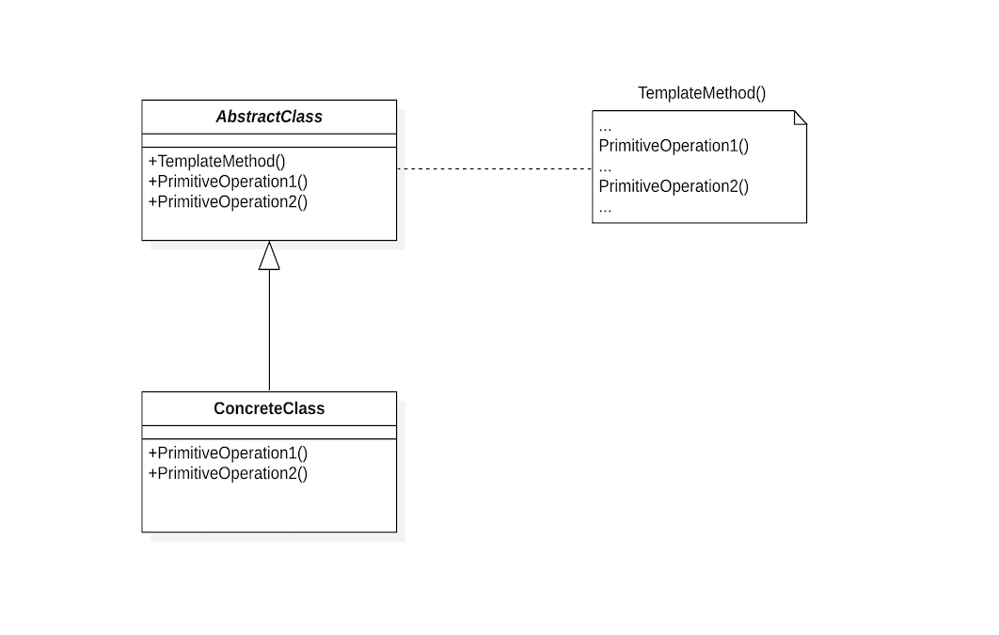
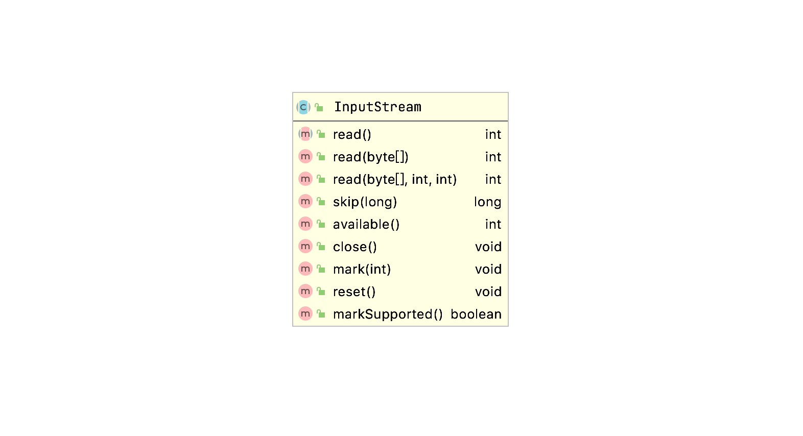

# Template Method - 模板方法

> 定义一个操作中的算法的骨架，而将一些步骤延迟到子类中。TemplateMethod使得子类可以不改变一个算法的结构即可重定义该算法的某些特定步骤。

## 动机

平时的工作中会经常与***Batch Processing***打交道，一个系统动则就会有几十甚至上百个Batch处理，而这些Batch处理除了核心部分不同之外几乎没有什么其它不一样的地方，如果要通过复制粘贴将这些相同的处理适用到每一个Batch上的话未免有点可爱，当这些相同的处理中发现了问题需要修改时，所要花费的时间和精力是不可估量的。如何将这些处理共通化呢？像下面这样子（Java Batch），**Template Method - 模板方法**或许可以帮我们解决这个问题。

```java
public abstract class MyAbstractBatchlet extends AbstractBatchlet {

    @Override
    public String process() throws Exception {
        preProcess();
        process1();
        postProcess();

        return BatchStatus.COMPLETED.toString();
    }

    public abstract void process1() throws Exception;

    public void preProcess() {
        // do something
    }

    public void postProcess() {
        // do something
    }

}
```

我们称`process()`为一个**模板方法**。一个模板方法用一些抽象的操作（这里为`process1()`）和一些具体的操作（这里为`preProcess()`和`postProcess()`）定义一个算法，确定了它们的先后顺序，而子类将重定义这些抽象操作以提供具体的行为或重定义这些具体操作以扩展默认行为。

## 结构



* AbstractClass
  * 定义抽象的**原语操作**（primitive operation），具体的子类将重定义它们以实现一个算法的各步骤。
  * 实现一个模板方法，定义一个算法的骨架。模板方法调用下列类型的操作：
    * 具体的操作
    * 具体的AbstractClass的操作
    * 原语操作
    * 工厂方法（Factory Method）
    * 钩子操作（Hook Operations），它提供了缺省的行为，子类可以在必要时进行扩展。一个钩子操作的缺省行为往往为空。
* ConcreteClass
  * 实现原语操作以完成算法中与特定子类相关的步骤。

## 适用性

* 一次性实现一个算法的不变的部分，并将可变的行为留给子类来实现。
* 各子类中公共的行为应被提取出来并集中到一个公共父类中以避免代码重复。
* 控制子类扩展。模板方法只在特定点调用"hook"操作，这样就只允许在这些点进行扩展。

## 效果

* 模板方法是一种代码复用的基本技术。
* 模板方法导致一种反向的控制结构。即一个父类调用一个子类的操作，而不是相反。

## 权衡

虽然定义模板方法的一个重要目的是尽量减少一个子类具体实现该算法时必须重定义的那些原语操作的数目（需要重定义的操作越多，程序就越冗长），但并不意味着将几乎所有的具体操作都放在模板方法中，考虑到子类的自由度，有效地重用一个抽象类等因素，程序设计者必须结合具体情况去决定哪些操作是钩子操作（可以被重定义），哪些操作是抽象操作（必须被重定义）。

## 应用实例

1. JDK中的`InputStream`。

   

   ```java
    public int read(byte b[], int off, int len) throws IOException {
       if (b == null) {
           throw new NullPointerException();
       } else if (off < 0 || len < 0 || len > b.length - off) {
           throw new IndexOutOfBoundsException();
       } else if (len == 0) {
           return 0;
       }

       int c = read();
       if (c == -1) {
           return -1;
       }
       b[off] = (byte)c;

       int i = 1;
       try {
           for (; i < len ; i++) {
               c = read();
               if (c == -1) {
                   break;
               }
               b[off + i] = (byte)c;
           }
       } catch (IOException ee) {
       }
       return i;
   }
   
   public abstract int read() throws IOException;
   ```
   | Template Method      | Template Method in Java |
   | -------------------- | ----------------------- |
   | AbstractClass        | InputStream             |
   | TemplateMethod()     | read(byte[], int, int)  |
   | PrimitiveOperation() | read()                  |

