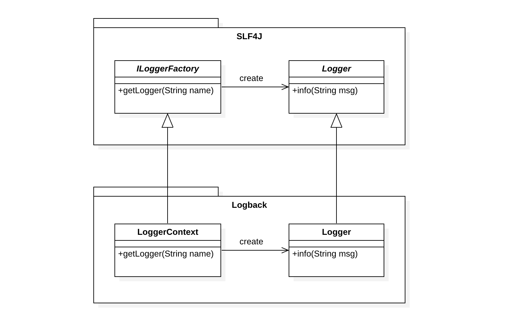
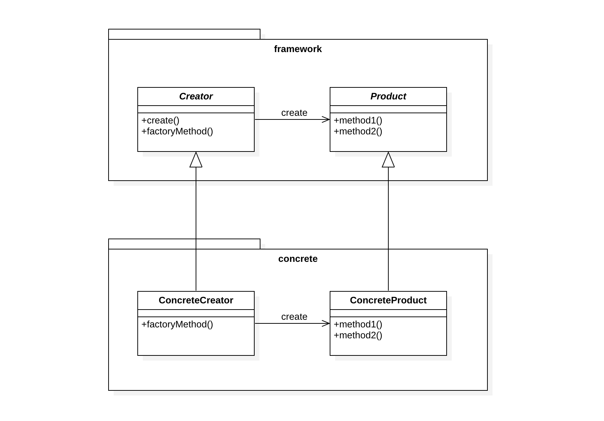
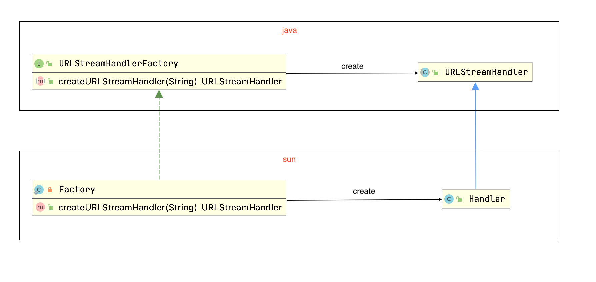

# Factory Method - 工厂方法

> 定义一个用于创建对象的接口，让子类决定实例化哪一个类。Factory Method使一个类的实例化延迟到其子类。

## 动机

框架使用抽象类定义和维护对象之间的关系，这些对象的创建通常也由框架负责。这时就会有一个尴尬的局面，框架必须实例化类，但是它只知道不能被实例化的抽象类。为了解决这个问题，首先我们知道模板方法（Template Method）可以定义一个操作中的算法骨架，而将一些步骤延迟到子类中，使用模板方法可以将一个类的实例化延迟到其子类。像这样子将模板方法适用到实例创建的场合，我们可以称其为工厂方法（Factory Method）。

平时会选择使用[Logback](http://logback.qos.ch/)来作为日志框架，而Logback则是[SLF4J](http://www.slf4j.org/)的一种实现。它们是使用工厂方法模式的典型案例，SLF4J定义日志框架，Logback提供其实现。

> The Simple Logging Facade for Java (SLF4J) serves as a simple facade or abstraction for various logging frameworks (e.g. java.util.logging, logback, log4j) allowing the end user to plug in the desired logging framework at *deployment* time.



客户端程序中会使用SLF4J所提供的具体类`LoggerFactory`的`getLogger(String name)`方法来获取`Logger`的实例。

```java
Logger logger = LoggerFactory.getLogger("chapters.introduction.HelloWorld1");
```

而`getLogger(String name)`方法中则去捆绑了Logback并使用Logback的`LoggerContext`去创建了具体的`Logger`实例。

```java
/**
 * Return a logger named according to the name parameter using the
 * statically bound {@link ILoggerFactory} instance.
 * 
 * @param name
 *            The name of the logger.
 * @return logger
 */
public static Logger getLogger(String name) {
   ILoggerFactory iLoggerFactory = getILoggerFactory();
   return iLoggerFactory.getLogger(name);
}
```

## 结构



* Product
  * 定义工厂方法所创建的对象的接口。
* ConcreteProduct
  * 实现Product接口。
* Creator
  * 声明工厂方法，该方法返回一个Product类型的对象。Creator也可以定义一个工厂方法的缺省实现，它返回一个缺省的ConcreteProduct对象。
  * 可以调用工厂方法以创建一个Product对象。
* ConcreteCreator
  * 重定义工厂方法以返回一个ConcreteProduct实例。

## 适用性

* 当一个类不知道他所必须创建的对象的类的时候。
* 当一个类希望由它的子类来指定它所创建的对象的时候。
* 当类将创建对象的职责委托给多个帮助子类中的某一个，并且你希望将哪一个帮助子类是代理者这一信息局部化的时候。

## 效果

* 工厂方法不再将与特定应用有关的类绑定到你的代码中。代码仅处理Product接口，因此它可以与用户定义的任何ConcreteProduct类一起使用。
* 为子类提供挂钩（hook）。用工厂方法在一个类的内部创建对象通常比直接创建对象更灵活。工厂方法给子类一个挂钩以提供对象的扩展版本。
* 连接平行的类层次。当一个类将它的一些职责委托给一个独立的类的时候，就产生了平行类层次。工厂方法通过将哪些类应一同工作的信息局部化来定义两个类层次之间的连接。

## 权衡

使用工厂方法时可能会有以下问题，应结合实际业务场景，适度使用工厂方法。

* 类的个数容易过多，增加复杂度。
* 增加了系统的抽象性和理解难度。

## 应用实例

1. JDK中的`URLStreamHandlerFactory`。

   

    | Factory Method  | Factory Method in JDK   |
    | --------------- | ----------------------- |
    | Product         | URLStreamHandler        |
    | ConcreteProduct | Handler                 |
    | Creator         | URLStreamHandlerFactory |
    | ConcreteCreator | Factory                 |

