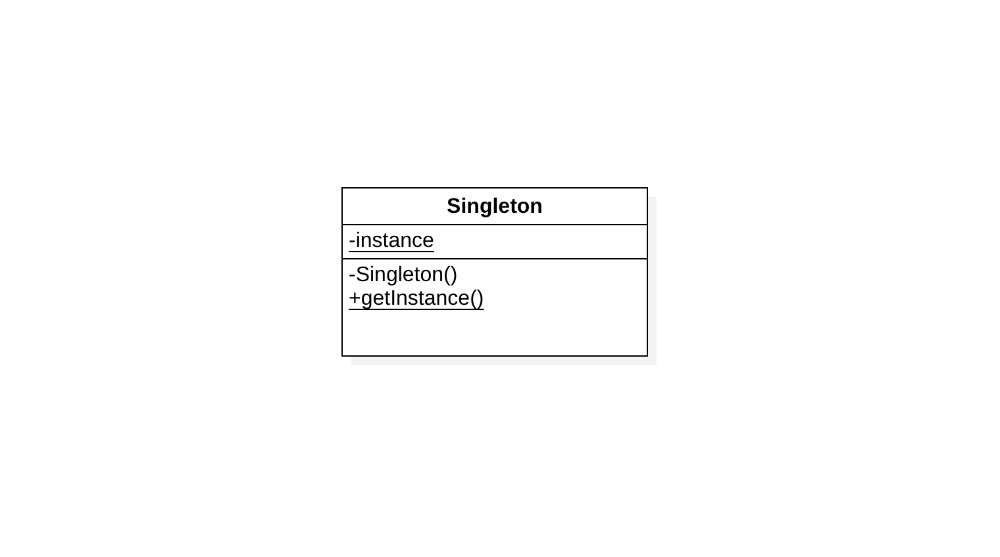

# Singleton - 单例

> 保证一个类仅有一个实例，并提供一个访问它的全局访问点。

## 动机

如果说程序设计是对现实世界的抽象，那么单例模式的出现将会是理所当然。一个操作系统只应该有一个文件系统和一个窗口管理器，一个会计系统只能专用于一个公司。映射到程序设计中，对于一些类来说，只有一个实例是很重要的。在这种情况下，我们需要保证一个类只有一个实例并且这个实例易于被访问。做法是让类自身负责保存它的唯一实例，这个类可以保证没有其他实例可以被创建，并且它可以提供一个访问该实例的方法。这就是单例模式（Singleton）。

## 结构



* Singleton
  * 定义一个`getInstance()`操作，允许客户访问它的唯一实例。
  * 负责创建它自己的唯一实例

## 适用性

* 当类只能有一个实例而且客户可以从一个众所周知的访问点访问它时。
* 当这个唯一实例应该是通过子类化可扩展的，并且客户应该无需更改代码就能使用一个扩展的实例时。
* 当你想控制一个类所生成的实例的个数时（并非只是一个）。

## 实现

通常单例模式在JAVA语言中，有两种构建方式：

1. 饿汉方式。指全局的单例实例在类装载时构建。
2. 懒汉方式。指全局的单例实例在第一次被使用时构建。

**饿汉方式**：

```java
public class Singleton {

    private static final Singleton INSTANCE = new Singleton();

    private Singleton() {

    }

    public static Singleton getInstance() {
        return INSTANCE;
    }

}
```

**懒汉方式（双重锁检测）**：

```java
public class Singleton {

    private static volatile Singleton instance;

    private Singleton() {

    }

    // Thread safe and performance promote
    public static Singleton getInstance() {
        if (instance == null) {
            synchronized (Singleton.class) {
                // When more than two threads run into the first null check same time,
                // to avoid instanced more than one time, it needs to be checked again.
                if (instance == null) {
                    instance = new Singleton();
                }
            }
        }
        return instance;
    }

}
```

**懒汉方式（静态内部类）**：

```java
public class Singleton {

    private static class LazyHolder {
        private static final Singleton INSTANCE = new Singleton();
    }

    private Singleton() {

    }

    public static Singleton getInstance() {
        return LazyHolder.INSTANCE;
    }

}
```

由于classloader的加载机制，INSTANCE对象的初始化并不是在`Singleton`类被加载时，而是在`getInstance()`方法被调用时，同时该方法保证构建单例的线程安全。

**饿汉方式（枚举）**：

```java
public enum Singleton {
    INSTANCE
}
```

## 应用实例

1. `java.lang.Runtime`

   ```java
   public class Runtime {
       private static Runtime currentRuntime = new Runtime();
   
       /**
        * Returns the runtime object associated with the current Java application.
        * Most of the methods of class <code>Runtime</code> are instance
        * methods and must be invoked with respect to the current runtime object.
        *
        * @return  the <code>Runtime</code> object associated with the current
        *          Java application.
        */
       public static Runtime getRuntime() {
           return currentRuntime;
       }
   
       /** Don't let anyone else instantiate this class */
       private Runtime() {}
   }
   ```

   

