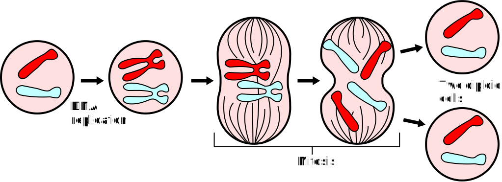

# Prototype - 原型

> 用原型实例指定创建对象的种类，并且通过拷贝这些原型创建新的对象。

## 动机

有丝分裂是真核细胞将其细胞核中染色体分配到两个子核之中的过程。该过程产生两个与母细胞基因相同的子细胞。



有丝分裂对于维持个体的生长和发育以及保证物种的连续性和稳定性具有重要意义，在程序设计中，原型模式（Prototype）的出现或许并非是一个巧合。

如果你有一个对象，你想创建一个和其完全相同的复制品，你会怎么做呢？通常的做法是使用`new`关键字加上该对象的类名来初始化一个对象，随后遍历原有对象的各个属性将其属性值复制到新的对象上。这样做可能会有两个问题。一个问题是该类的所有属性并不一定都是可见的，当然这或许算不上一个问题，因为你可以通过反射来解决它。另一个问题是你在你的代码中指定了具体类的类名，这将使你的代码与具体的类紧密地耦合在一起，倘若我们知道的仅仅是一个接口而不是具体的类，这种做法将无法完成需求。

那么该如何去做呢？原型模式（Prototype）为我们提供了一种解决方案。它通过将克隆过程委托给被克隆的实际对象，为那些可被克隆的实际对象声明一个公共的接口来完成解耦，通常该接口仅包含一个克隆方法。

## 结构


* Prototype
  * 声明一个克隆自身的接口。
* ConcretePrototype
  * 实现一个克隆自身的操作。
* Client
  * 让一个原型克隆自身从而创建一个新的对象。

## 适用性

* 当一个系统应该独立于它的产品创建、构成和表示时。
* 当要实例化的类是在运行时刻指定时。
* 为了避免创建一个与产品类层次平行的工厂类层次时。
* 当一个类的实例只能有几个不同状态组合中的一种时。

## 效果

* 你可以克隆对象，而无需与他们所属的具体类相耦合。
* 你可以克隆预生成原型，避免反复运行初始化代码。
* 你可以更方便地生成复杂对象。
* 你可以用继承以外的方式来处理复杂对象的不同配置。

## 应用实例

1. `java.lang.Cloneable`

   ```java
   package java.lang;
   
   public interface Cloneable {
   }
   ```

   `Cloneable`为一个标记性接口，一个类如果实现了`Cloneable`接口，那么使用`Object.clone()`方法去完成对该类实例的field-for-field复制将会是合法的。

   * 默认的`Object.clone()`方法完成的是浅拷贝，你可以通过覆写该方法完成对对象的深拷贝。

   * `Object.clone()`方法的访问权限为`protected`， 如果要在非子类的其他类中调用的话需要对该方法进行适配。

   *ArrayContainer.java*

   ```java
   public interface ArrayContainer extends Cloneable {
   
       ArrayContainer createClone();
   
       int[] getArray();
   
   }
   ```

   *ArrayContainerShallow.java*

   ```java
   public class ArrayContainerShallow implements ArrayContainer {
   
       private int[] array = new int[] {
               1, 2, 3, 4, 5, 6, 7, 8, 9, 10
       };
   
       @Override
       public int[] getArray() {
           return array;
       }
   
       @Override
       public ArrayContainer createClone() {
           ArrayContainer container = null;
           try {
               container = (ArrayContainer) clone();
           } catch (CloneNotSupportedException e) {
               e.printStackTrace();
           }
           return container;
       }
   
   }
   ```

   *ArrayContainerDeep.java*

   ```java
   public class ArrayContainerDeep implements ArrayContainer {
   
       private int[] array = new int[] {
               1, 2, 3, 4, 5, 6, 7, 8, 9, 10
       };
   
       @Override
       public int[] getArray() {
           return array;
       }
   
       @Override
       protected Object clone() throws CloneNotSupportedException {
           ArrayContainerDeep result = (ArrayContainerDeep) super.clone();
           result.array = result.array.clone();
           return result;
       }
   
       @Override
       public ArrayContainer createClone() {
           ArrayContainer container = null;
           try {
               container = (ArrayContainer) clone();
           } catch (CloneNotSupportedException e) {
               e.printStackTrace();
           }
           return container;
       }
   
   }
   ```

   *Main.java*

   ```java
   public class Main {
   
       public static void main(String[] args) {
           ArrayContainer shallow = new ArrayContainerShallow();
           ArrayContainer deep = new ArrayContainerDeep();
           System.out.println(shallow.getArray());
           System.out.println(shallow.createClone().getArray());
           System.out.println(deep.getArray());
           System.out.println(deep.createClone().getArray());
           System.out.println(Arrays.toString(shallow.getArray()));
           System.out.println(Arrays.toString(shallow.createClone().getArray()));
           System.out.println(Arrays.toString(deep.getArray()));
           System.out.println(Arrays.toString(deep.createClone().getArray()));
       }
   
   }
   ```

   *Output*

   ```txt
   [I@6e0be858
   [I@6e0be858
   [I@61bbe9ba
   [I@610455d6
   [1, 2, 3, 4, 5, 6, 7, 8, 9, 10]
   [1, 2, 3, 4, 5, 6, 7, 8, 9, 10]
   [1, 2, 3, 4, 5, 6, 7, 8, 9, 10]
   [1, 2, 3, 4, 5, 6, 7, 8, 9, 10]
   ```

   