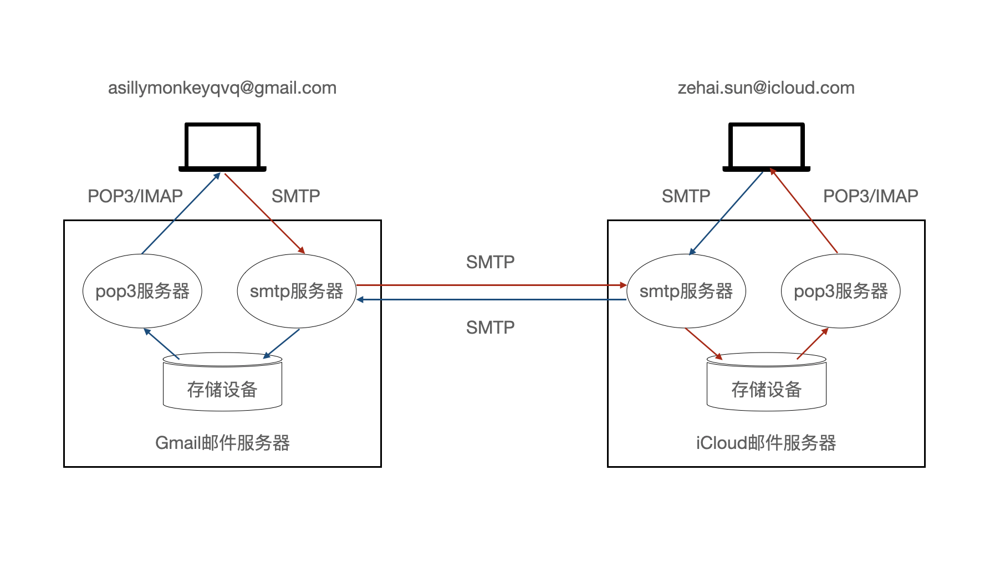
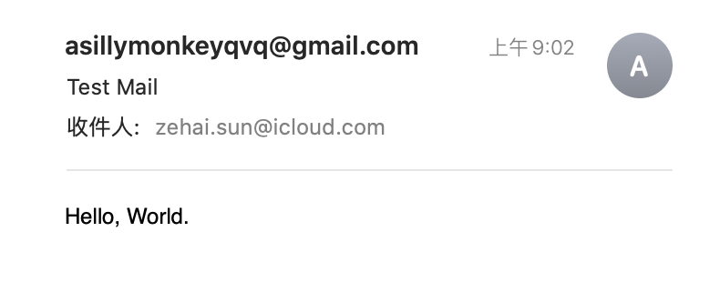
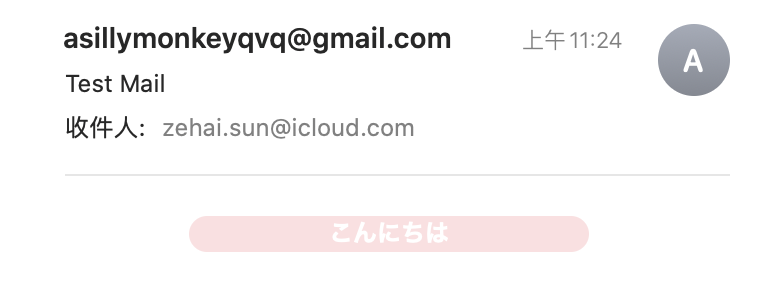
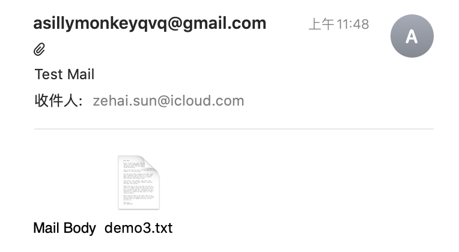

# Using JavaMail API

工作中会不时遇到使用程序来发送电子邮件的需求，如何使用JavaMail API去发送一封电子邮件在这里做简单记述。

## 协议

在电子邮件的收发过程中，会使用到两种类型的协议。

1. 发送邮件
   * [简单邮件传输协议](https://zh.wikipedia.org/wiki/%E7%AE%80%E5%8D%95%E9%82%AE%E4%BB%B6%E4%BC%A0%E8%BE%93%E5%8D%8F%E8%AE%AE)（Simple Mail Transfer Photocol, SMTP）
2. 接收邮件
   * [邮局协议第三版](https://zh.wikipedia.org/wiki/%E9%83%B5%E5%B1%80%E5%8D%94%E5%AE%9A)（Post Office Protocol - Version 3, POP3）
   * [因特网信息访问协议](https://zh.wikipedia.org/wiki/%E5%9B%A0%E7%89%B9%E7%BD%91%E4%BF%A1%E6%81%AF%E8%AE%BF%E9%97%AE%E5%8D%8F%E8%AE%AE)（Internet Message Access Protocol, IMAP）

## 流程



## 准备工作

从[Gmail官网](https://support.google.com/mail/answer/7126229)查询发送电子邮件所需的SMTP服务器地址。

> **发送邮件 (SMTP) 服务器**
> 
> smtp.gmail.com
> 
> 要求 SSL：是
> 
> 要求 TLS：是（如适用）
> 
> 使用身份验证：是
> 
> SSL 端口：465
> 
> TLS/STARTTLS 端口：587

可以看到Gmail提供了两种方式来发送电子邮件，关于SSL/TLS/STARTTLS：

> **传输层安全性协议**（英语：**T**ransport **L**ayer **S**ecurity，缩写：**TLS**）及其前身**安全套接层**（英语：**S**ecure **S**ockets **L**ayer，缩写：**SSL**）是一种安全协议，目的是为互联网通信提供安全及数据完整性保障。

> **STARTTLS**，是一种明文通信协议的扩展，能够让明文的通信连线直接成为加密连线（使用SSL或TLS加密），而不需要使用另一个特别的端口来进行加密通信，属于机会性加密。

在这里我们使用TLS/STARTTLS协议。

## Maven 依赖

```xml
<!-- JavaMail API JAR -->
<dependency>
    <groupId>javax.mail</groupId>
    <artifactId>javax.mail-api</artifactId>
    <version>1.6.2</version>
</dependency>
```

## JavaMail API

### [Message](https://javaee.github.io/javamail/docs/api/)

该类模拟了一封电子邮件。为抽象类，由子类提供具体实现。

Message包含一组属性和一个"内容"，为了发送电子邮件，需要实例化Message的适当子类（例如MimeMessage），填充属性和内容，然后使用`Transport.send`方法来发送。

`Message.RecipientType`枚举了收件人的三种类型 - TO、CC、 BCC。


* `setFrom(Address address)` - 设定发件人

* `setRecipient(Message.RecipientType type, Address address)` - 设定一个收件人

* `setRecipients(Message.RecipientType type, Address[] addresses)` - 设定一组收件人

* `setSentDate(Date date)` - 设定发送日期

* `setSubject(String subject)` - 设定主题

### [Session](https://javaee.github.io/javamail/docs/api/)

该类模拟了一个电子邮件会话。

该类提供了对实现`Store`、`Transport`和其他相关类的协议提供者的访问。

可以由以下静态工厂方法来获取该类的对象。

* `getInstance(Properties props)`
* `getInstance(Properties props, Authenticator authenticator)`

### [Transport](https://javaee.github.io/javamail/docs/api/)

该类模拟了一封电子邮件的转送。为抽象类，由子类提供具体实现。

使用静态方法`send(Message msg)`来发送一封电子邮件。

* `send(Message msg)`

## Demo1: Hello, World.

*Demo1.java*

```java
public class Demo1 {

    public static void main(String[] args) throws Exception {
        final String username = "asillymonkeyqvq";
        final String password = "put your password here";

        Properties props = new Properties();
        props.setProperty("mail.smtp.host", "smtp.gmail.com"); // SMTP服务器地址
        props.setProperty("mail.smtp.port", "587"); // SMTP服务器端口号
        props.setProperty("mail.smtp.auth", "true"); // 启用身份验证
        props.setProperty("mail.smtp.starttls.enable", "true"); // 声明使用STARTTLS

        // 构建会话对象
        Session session = Session.getInstance(props, new Authenticator() {
            @Override
            protected PasswordAuthentication getPasswordAuthentication() {
                return new PasswordAuthentication(username, password);
            }
        });
        session.setDebug(true); // 启用debug模式

        // 构建电子邮件对象
        Message message = new MimeMessage(session);
        message.setFrom(new InternetAddress("asillymonkeyqvq@gmail.com"));
        message.setRecipients(Message.RecipientType.TO, InternetAddress.parse("zehai.sun@icloud.com"));
        message.setSubject("Test Mail");
        message.setText("Hello, World.");

        // 发送电子邮件
        Transport.send(message);
    }

}
```

查收邮件



## Demo2: 发送一封html格式的电子邮件

*Demo2.java*

```java
public class Demo2 {

    public static void main(String[] args) throws Exception {
        final String username = "asillymonkeyqvq";
        final String password = "put your password here";

        Properties props = new Properties();
        props.setProperty("mail.smtp.host", "smtp.gmail.com"); // SMTP服务器地址
        props.setProperty("mail.smtp.port", "587"); // SMTP服务器端口号
        props.setProperty("mail.smtp.auth", "true"); // 启用身份验证
        props.setProperty("mail.smtp.starttls.enable", "true"); // 声明使用STARTTLS

        // 构建会话对象
        Session session = Session.getInstance(props, new Authenticator() {
            @Override
            protected PasswordAuthentication getPasswordAuthentication() {
                return new PasswordAuthentication(username, password);
            }
        });
        session.setDebug(true); // 启用debug模式

        // 构建电子邮件对象
        Message message = new MimeMessage(session);
        message.setFrom(new InternetAddress("asillymonkeyqvq@gmail.com"));
        message.setRecipients(Message.RecipientType.TO, InternetAddress.parse("zehai.sun@icloud.com"));
        message.setSubject("Test Mail");
        String content = Files.lines(Paths.get("src/main/resources/demo2.html")).collect(Collectors.joining("\n"));
        message.setContent(content, "text/html;charset=utf-8");

        // 发送电子邮件
        Transport.send(message);
    }

}
```

设定邮件内容类型为html: message.setContent(content, "text/html;charset=utf-8");

*demo2.html*

```html
<!DOCTYPE html>
<html lang="ja">
    <head>
        <meta charset="UTF-8">
        <title>こんにちは</title>
        <style>
            * {
                margin: 0;
                padding: 0;
            }
            .foo {
                width: 200px;
                margin: 20px auto;
                background-color: #FEDFE1;
                border-radius: 10px;
                text-align: center;
            }
            .foo a {
                font-weight: bold;
                color: #FFFFFF;
                text-decoration: none;
            }
        </style>
    </head>
    <body>
        <div class="foo">
            <a href="http://www.sunzehai.com">こんにちは</a>
        </div>
    </body>
</html>
```

查收邮件:



## Demo3: 发送一封带有附件的电子邮件

*Demo3.java*

```java
public class Demo3 {

    public static void main(String[] args) throws Exception {
        final String username = "asillymonkeyqvq";
        final String password = "put your password here";

        Properties props = new Properties();
        props.setProperty("mail.smtp.host", "smtp.gmail.com"); // SMTP服务器地址
        props.setProperty("mail.smtp.port", "587"); // SMTP服务器端口号
        props.setProperty("mail.smtp.auth", "true"); // 启用身份验证
        props.setProperty("mail.smtp.starttls.enable", "true"); // 声明使用STARTTLS

        // 构建会话对象
        Session session = Session.getInstance(props, new Authenticator() {
            @Override
            protected PasswordAuthentication getPasswordAuthentication() {
                return new PasswordAuthentication(username, password);
            }
        });
        session.setDebug(true); // 启用debug模式

        // 构建电子邮件对象
        Message message = new MimeMessage(session);
        message.setFrom(new InternetAddress("asillymonkeyqvq@gmail.com"));
        message.setRecipients(Message.RecipientType.TO, InternetAddress.parse("zehai.sun@icloud.com"));
        message.setSubject("Test Mail");

        BodyPart messageBodyPart = new MimeBodyPart();
        messageBodyPart.setText("Mail Body");

        MimeBodyPart attachmentPart = new MimeBodyPart();
        attachmentPart.attachFile(new File("src/main/resources/demo3.txt"));

        Multipart multipart = new MimeMultipart();
        multipart.addBodyPart(messageBodyPart);
        multipart.addBodyPart(attachmentPart);

        message.setContent(multipart);

        // 发送电子邮件
        Transport.send(message);
    }

}
```

查收邮件:



