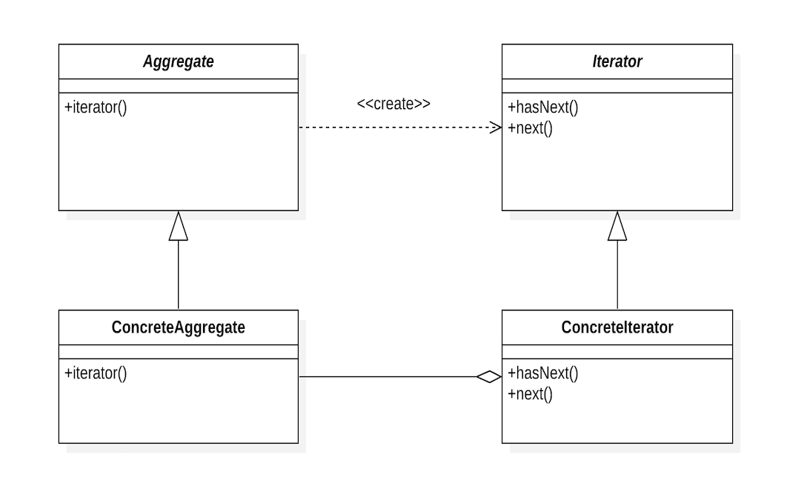
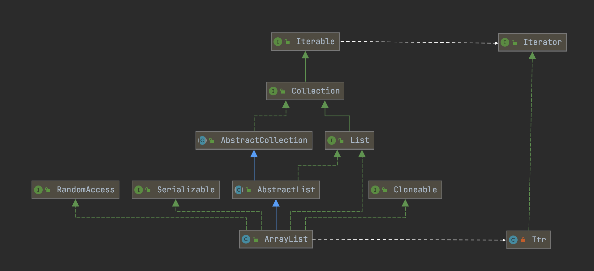

# Iterator - 迭代器
> 提供一种方法顺序访问一个聚合对象中各个元素，而又不需要暴露该对象的内部表示。

如果说要对一个聚合对象（如List）进行遍历操作，最先想到的方法可能是像下面一样去使用for循环。利用`get(int)`方法来访问特定位置的元素，利用递增的`i`来完成对列表的扫描，利用`size()`方法来获取列表元素的个数用以对循环是否终止的判断。
```java
for (int i = 0; i < list.size(); i++) {
    System.out.println(list.get(i));
}
```
这是我们自己手动遍历列表的一种方法，看上去似乎没有什么太大的问题，但如果涉及到List的具体实现，或许差别就会显现出来（`get(int)`方法只有`ArrayList`的实现是高效的，如果换成`LinkedList`，索引越大，访问速度会变得越慢）。我们所期望的是由聚合对象提供一种方法来让我们可以遍历访问它的元素，而又不需暴露它的内部结构。迭代器模式帮我们做到了这一点。它的核心思想在于将对列表的访问和遍历从列表对象中分离出来并放入一个迭代器对象中。

迭代器类定义了一个访问该列表元素的接口，通过在对其实例化时提供待遍历的列表来完成对列表元素的顺序访问。同时将遍历机制与列表对象分离使我们可以定义不同的迭代器来实现不同的遍历策略而无需在列表接口中去列举它们。

为了解决迭代器和列表之间的耦合，使我们能够不需改变客户端的代码来完成对具体聚合类对象的替换，**多态迭代**的概念应运而生，通过定义抽象的聚合类（提供操作聚合对象的公共接口）与抽象的迭代器类（提供公共的迭代接口），由具体的聚合子类对象负责创建具体的迭代器子类对象来完成解耦。

## 结构



* Aggregate
  - 定义创建相应迭代器对象的接口。
* Iterator
  - 定义访问和遍历元素的接口。
* ConcreteAggregate
  - 实现创建相应迭代器的接口，该操作返回ConcreteIterator的一个适当的实例。
* ConcreteIterator
  - 实现迭代器接口。
  - 对该聚合遍历时跟踪当前位置。

## 适用性
* 访问一个聚合对象的内容而无需暴露它的内部表示。
* 支持对聚合对象的多种遍历。
* 为遍历不同的聚合结构提供一个统一的接口（即支持多态迭代）。

## 效果
* 支持以不同的方式遍历一个聚合。
* 简化了聚合的接口。
* 在同一个聚合上可以同时进行多个遍历（每个迭代器保持它自己的遍历状态）。

## 应用实例
1. Java中的ArrayList
  
  
    | Iterator Pattern  | Iterator Pattern in Java    |
    | ----------------- | --------------------------- |
    | Aggregate         | Iterable                    |
    | Iterator          | Iterator                    |
    | ConcreteAggregate | ArrayList                   |
    | ConcreteIterator  | Itr (ArrayList的私有内部类) |
  
  
  
2. Java中的for each循环

   ```java
   for (Object item : list) {
       // ・・・
   }
   ```

   Java编译器本身并不知道如何遍历集合对象，但它会自动把`for each`循环变成对Iterator的调用，像下面这样子。
   ```java
   for (Iterator iterator = list.iterator(); iterator.hasNext();) {
       Object item = iterator.next();
       // ・・・
   }
   ```
